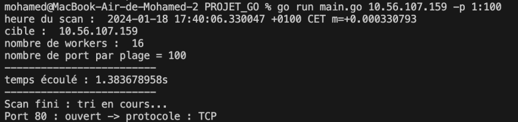

<h1 align="center">

<br>
</h1>



<p align="center">
<a href="#features">Features</a> --
<a href="#Installation">Installation</a> --
<a href="#usage">Usage</a>
</p>


InsightNet Scanner est un scanneur de ports écrit en Go qui vous permet d'énumérer les ports ouverts en TCP sur un hôte distant.

# Features


<h1 align="center">

<br>
</h1>

- Scan de port TCP en utilisant des goroutines --> utilisation de paramètres afin d'en tirer le meilleur temps
- Choix du nombre de **workers**
- Choix de la **plage de ports** ou du **port**
- Choix du nombre de **port par plage**

# Installation


``` git clone https://github.com/ThomasRAYNAUD/ELP.git ```

L'exécutable .go est dans ./GO/scan.go

